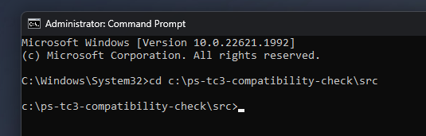
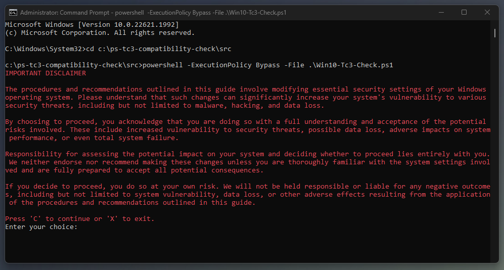

# TwinCAT Runtime Compatibility Check (Beta)

## Disclaimer
This is a personal guide not a peer reviewed journal or a sponsored publication. We make
no representations as to accuracy, completeness, correctness, suitability, or validity of any
information and will not be liable for any errors, omissions, or delays in this information or any
losses injuries, or damages arising from its display or use. All information is provided on an as
is basis. It is the reader’s responsibility to verify their own facts.

The views and opinions expressed in this guide are those of the authors and do not
necessarily reflect the official policy or position of any other agency, organization, employer or
company. Assumptions made in the analysis are not reflective of the position of any entity
other than the author(s) and, since we are critically thinking human beings, these views are
always subject to change, revision, and rethinking at any time. Please do not hold us to them
in perpetuity.

## Overview 
This is a collection of powershell scripts used to identify common TwinCAT 3 incompatible settings in Windows.

## Screenshot


## Getting Started

### Step 1 - Open Powershell as Administrator
Click on your start menu, type cmd, then click Run as administrator


### Step 2 - Navigate to the script location
The location of your script may differ!



### Step 3 - Run the script with using the bypass flag

#### Windows 10
```bash
powershell -ExecutionPolicy Bypass -File .\Win10-Tc3-Check.ps1
```

#### Windows 11
```bash
powershell -ExecutionPolicy Bypass -File .\Win11-Tc3-Check.ps1
```

### Step 4 - Read the disclaimer
Press C if you agree or X to exit



### Troubleshooting
Depending on your system settings you may see the following error message. 


This simply means that you did not run CMD as an administrator, you did not use the bypass, or the running of scripts has been disabled on your system.

## Suggestions, Questions or Problems
Please post any suggestions, questions or problems in to the issues tab on the repo. 
