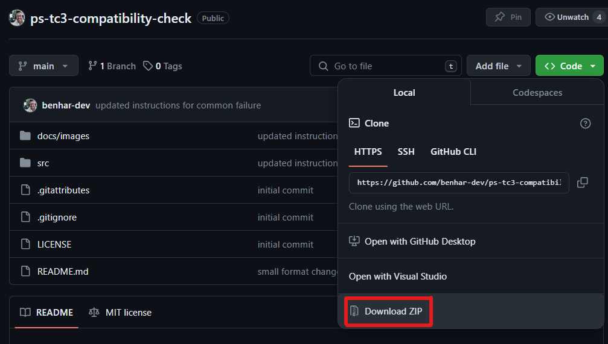
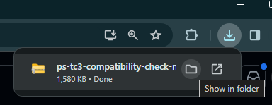
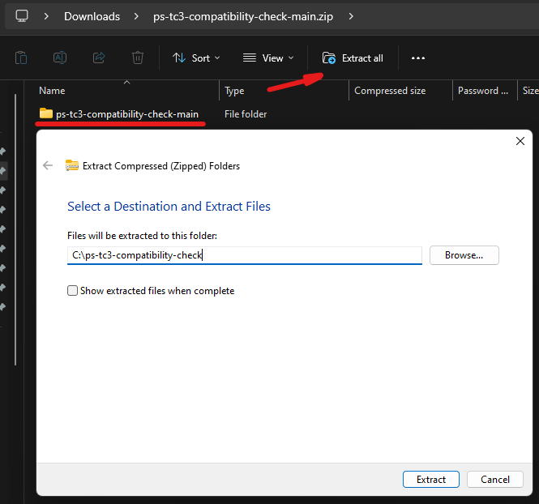

# TwinCAT Runtime Compatibility Check (Beta)

## Disclaimer

This is a personal guide not a peer reviewed journal or a sponsored publication. We make
no representations as to accuracy, completeness, correctness, suitability, or validity of any
information and will not be liable for any errors, omissions, or delays in this information or any
losses injuries, or damages arising from its display or use. All information is provided on an as
is basis. It is the reader’s responsibility to verify their own facts.

The views and opinions expressed in this guide are those of the authors and do not
necessarily reflect the official policy or position of any other agency, organization, employer or
company. Assumptions made in the analysis are not reflective of the position of any entity
other than the author(s) and, since we are critically thinking human beings, these views are
always subject to change, revision, and rethinking at any time. Please do not hold us to them
in perpetuity.

## Overview

This is a collection of powershell scripts used to identify common TwinCAT 3 incompatible settings in Windows.

## Screenshot


## Getting Started

### Step 1 - Download the zip file

If you are comfortable with using git then feel free to clone the repo, however, if you are not a git user then simply click the green button at the top of the page and select "Download Zip".



### Step 2 - Find the zip file

Depending on your web browser, you will need to find the location of the downloaded zip. In chrome you can click the top bar and select "Show in folder"



### Step 3 - Extract the zip file

Click the zip folder and select "Extract all". Next type the location you wish to use. In this example we will use "C:\ps-tc3-compatibiity-check\". Please feel free to use any folder, just remember, you will need this for the next steps.



### Step 4 - Open Powershell as Administrator

Click on your start menu, type cmd, then click Run as administrator


### Step 5 - Navigate to the script location

The location of your script may differ! This is taken from step 3 with "\src" at the end.


### Step 6 - Run the script with using the bypass flag

#### Windows 10

```bash
powershell -ExecutionPolicy Bypass -File .\Win10-Tc3-Check.ps1
```

#### Windows 11

```bash
powershell -ExecutionPolicy Bypass -File .\Win11-Tc3-Check.ps1
```

### Step 7 - Read the disclaimer

Press C if you agree or X to exit


### Troubleshooting

Depending on your system settings you may see the following error message.


This simply means that you did not run CMD as an administrator, you did not use the bypass, or the running of scripts has been disabled on your system.

If you are unable to execute the script following these instructions then this is outside of what is possible to diagnose. You will need to contact your IT department. The restrictions you are seeing with running the script are likely to be interfering with the installation of TwinCAT.

## Suggestions, Questions or Problems

Please post any suggestions, questions or problems in to the issues tab on the repo.
