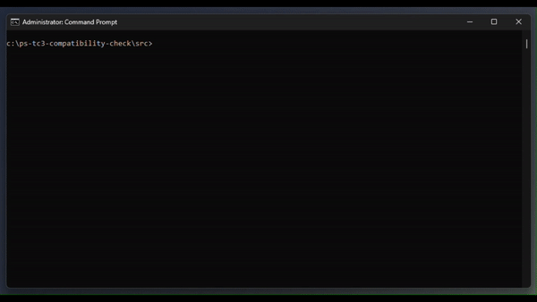
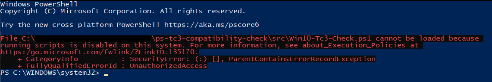
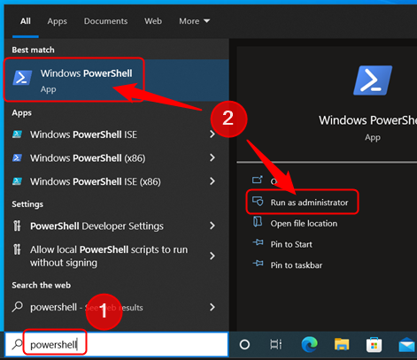
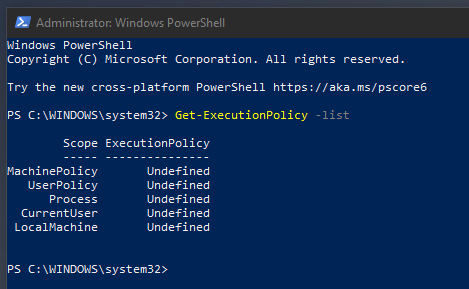
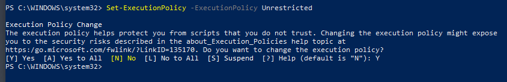
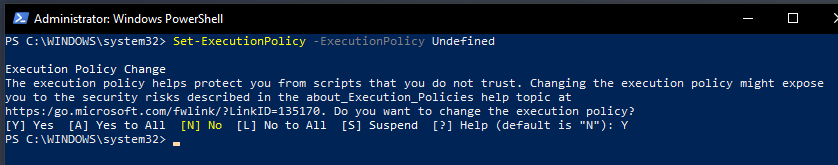

# TwinCAT Runtime Compatibility Check (Beta)

## Disclaimer
This is a personal guide not a peer reviewed journal or a sponsored publication. We make
no representations as to accuracy, completeness, correctness, suitability, or validity of any
information and will not be liable for any errors, omissions, or delays in this information or any
losses injuries, or damages arising from its display or use. All information is provided on an as
is basis. It is the reader’s responsibility to verify their own facts.

The views and opinions expressed in this guide are those of the authors and do not
necessarily reflect the official policy or position of any other agency, organization, employer or
company. Assumptions made in the analysis are not reflective of the position of any entity
other than the author(s) and, since we are critically thinking human beings, these views are
always subject to change, revision, and rethinking at any time. Please do not hold us to them
in perpetuity.

## Overview 
This is a collection of powershell scripts used to identify common TwinCAT 3 incompatible settings in Windows.

## Screenshot


## Getting Started

### Windows 10
Right click Win10-Tc3-Check.ps1 and select "Run with Powershell"

### Windows 11
Right click Win11-Tc3-Check.ps1 and select "Run with Powershell"

## Troubleshooting
Depending on your system settings you may see the following error message. 


This simply means that your current computer setup will not run powershell scripts.  You can adjust these settings in order to run this script, then once complete you can return them to their previous state.  

IMPORTANT DISCLAIMER
--------------------

The procedures and recommendations outlined in this guide involve modifying essential security settings of your Windows operating system. Please understand that such changes can significantly increase your system's vulnerability to various security threats, including but not limited to malware, hacking, and data loss.

By choosing to proceed, you acknowledge that you are doing so with a full understanding and acceptance of the potential risks involved. These include increased vulnerability to security threats, possible data loss, adverse impacts on system performance, or even total system failure.

Responsibility for assessing the potential impact on your system and deciding whether to proceed lies entirely with you. We neither endorse nor recommend making these changes unless you are thoroughly familiar with the system settings involved and are fully prepared to accept all potential consequences.

If you decide to proceed, you do so at your own risk. We will not be held responsible or liable for any negative outcomes, including but not limited to system vulnerability, data loss, or other adverse effects resulting from the application of the procedures and recommendations outlined in this guide.

### Step 1 - Open Powershell as Administrator
Click on your start menu, type powershell, then click Run as administrator


### Step 2 - Discover your current settings
Type ```Get-ExecutionPolicy -List``` to show your current settings.  Make a note of the item marked LocalMachine.  In this example it is set as Undefined.



### Step 3 - Change the policy to Unrestricted
Type ```Set-ExecutionPolicy -ExecutionPolicy Unrestricted```.  This will now allow Powershell scripts to be run.  



### Step 4 - Run the compatibility script again
You can now navigate to the original Powershell script in Windows Explorer, right click and select "Run with Powershell". 

### Step 5 - Return your settings back to default
Return back to your Administrator Powershell window and type ```Set-ExecutionPolicy -ExecutionPolicy Undefined```.  Replace Undefined with the value you had recorded in step 3 if different. 



## Suggestions, Questions or Problems
Please post any suggestions, questions or problems in to the issues tab on the repo. 
